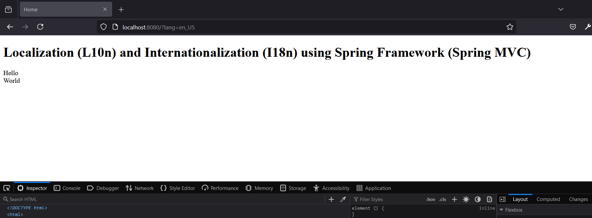
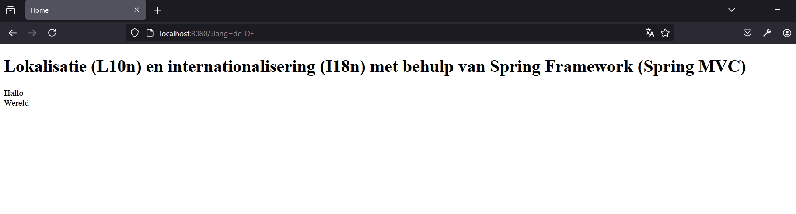

# Localization (L10n) and Internationalization (I18n)

## Introduction
This project demonstrates how to implement Localization (L10n) and Internationalization (I18n) in a Spring MVC application using XML configuration. 
It aims to provide a clear example of adapting application to various languages and regions,  🌐🚀

## Running the Application

1. **Build and Run:** Use your preferred build tool to compile and run the application.
2. **Access Application:** Open a web browser and navigate to `http://localhost:8080/`.
3. **Test Localization:**  Append ?lang=de_DE or ?lang=zu_ZU to the URL to see the application in different languages.

## License
This project is licensed with as CLOSED-SOURCE. See LICENSE file for details.